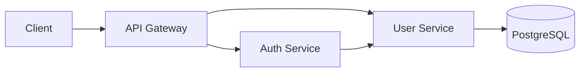

# User Service

User management microservice built with **Java 21** and **Spring Boot**.

This service is responsible for managing user data and providing user-related operations to other services in the application ecosystem.

## Architecture

The `user-service` is part of a microservices-based application and is designed to be independently deployable.



The **Auth Service** can communicate with the User Service when it needs to retrieve user information during authentication.

## Technologies

* Java 21
* Spring Boot 3.2.4
* Spring Web
* Spring Data JPA
* PostgreSQL
* Gradle
* REST API

The project uses Java 21 through the Gradle Java toolchain and PostgreSQL as its persistence database.

## Responsibilities

The User Service is responsible for:

* Creating users
* Managing user information
* Persisting users in PostgreSQL
* Retrieving users by their identifiers
* Retrieving users by email
* Providing user information to other microservices
* Encapsulating user persistence behind the service API

## Project Structure

The project follows a layered structure that separates HTTP, application, domain, and persistence responsibilities.

```text
src/
└── main/
    ├── java/
    │   └── com/
    │       └── kvales/
    │           └── userservice/
    │               ├── controller/
    │               ├── service/
    │               ├── domain/
    │               ├── repository/
    │               └── ...
    │
    └── resources/
        └── application.properties
```

## API

### Create User

Creates a new user.

```http
POST /api/users
Content-Type: application/json
```

Example request:

```json
{
  "name": "John Doe",
  "email": "john.doe@example.com",
  "password": "password"
}
```

Example response:

```json
{
  "id": "user-id",
  "name": "John Doe",
  "email": "john.doe@example.com"
}
```

### Get User by Email

Retrieves a user using their email address.

```http
GET /api/users?email=john.doe@example.com
```

This operation can be consumed by the **Auth Service** during the authentication process.


