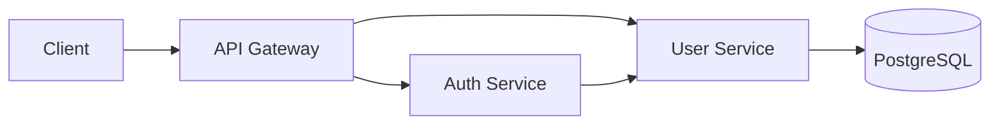

# User Service

User management microservice built with **Java 21** and **Spring Boot**.

This service is responsible for managing user data and providing user-related operations to other services in the application ecosystem.

## Architecture

The `user-service` is part of a microservices-based application and is designed to be independently deployable.

The **Auth Service** can communicate with the User Service when it needs to retrieve user information during authentication.

## Technologies

* Java 21
* Spring Boot 3.2.4
* Spring Web
* Spring Data JPA
* PostgreSQL
* Gradle
* REST API

The project uses Java 21 through the Gradle Java toolchain and PostgreSQL as its persistence database.
